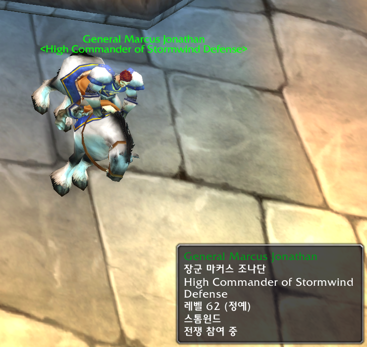

# TooltipKOR-TW
터틀와우 툴팁 한글 추가

*애드온의 목적은 영어 클라이언트에서 한글을 보고 싶어서 제작.*  
*오리지널 와우의 아이템, 마법, 오브젝트, npc(몹 포함)의 이름을 보기 위함*  
  
*pfquest, pfquest-turtle이 반드시 설치되어 있어야 합니다.*  

## 툴팁 적용 범위
마법, 아이템, 오브젝트, 유닛.  
### 마법
마법책, 행동단축바, 가방, 경매장, 우편함, 은행, 거래창, 상점, 직업 전문가, 케릭터 장비 화면, 나의 버프/디버프, 상대케릭 버프/디버프.  
  
일반적으로 보여지는 형태    
  
  
  
*버프/디버프는 빨리 봐야되는 경우가 발생하기에 유일하게 색 표현.*

  
화면에 출력되는 버프/디버프 효과 한글화.  

### 아이템
행동단축바, 가방, 경매장, 우편함, 은행, 거래창, 상점, 케릭터 장비 화면.  
  
일반적으로 보여지는 형태    
  
  
  
약초/채광 역시 한글 출력(미니맵에서도 정상 출력) 포함.  

  
  
경매장 아이템  

### 오브젝트
각종 표지판, 상점명, 퀘스트 관련 오브젝트 모두 포함.  

### 유닛
몹, npc 모두 포함.  

## 툴팁 예외 범위
### *아이템 비교 툴팁은 비정상 출력이 많아 한글화 제외, Aux 애드온은 정상 출력 허용*
### *마법, 아이템, 오브젝트가 동일 항목에 포함될 경우, 아이템 -> 마법 -> 오브젝트 순으로 적용.*

## 부가기능
### 아이템 검색 
한글 아이템 이름으로 영어 아이템 이름을 쉽게 출력하기 위함.  
아이템을 검색 할 경우 한글 띄어쓰기는 무시했으며, 리넨 옷감, 리넨옷감 결과값은 모두 동일함.  
오리지널 와우 아이템 대상.  
한글 데이터의 물리적인 한계로 모든 것을 담고 있지는 않음.

  

  
copycat 이라는 애드온 설치 후 영어로 출력된 이름 복사 가능.  
  
<u>*이후 경매장 검색 창에 붙여넣기*</u>  
  
### 비행경로 목적지 한글화  
  
### 서브존 한글화
특정 지역내에 포함된 작은 지역들(예: 구 시가지, 군사 지구 같은..)과 던전 내에 포함된 구역들 한글화.
## 한계
- 마법은 현재 터틀와우 클라이언트 데이터베이스에서 추출하여 클라이언트 업데이트가 발생하면 바로 적용이 안됨.
- 그외의 툴팁은 오리지널 와우에서 사용하는 모든 것들을 담음.
- *아이템, 오브젝트, 유닛은 한글 데이터의 물리적인 한계로 인해 영어로 출력되는 양도 꽤 많음.*
  
## 설치 방법
- <> Code를 눌러서 Download ZIP 선택.
- 다운로드 한 TooltipKOR-TW-main.zip을 터틀와우 설치 폴더\Interface\AddOns\ 아래에 압축 해제.
- TooltipKOR-TW-main을 TooltipKOR-TW으로 폴더 이름 변경.
- 터틀와우 접속 후 애드온 항목에 pfquest, pfquest-turtle, TooltipKOR-TW 체크.
  
